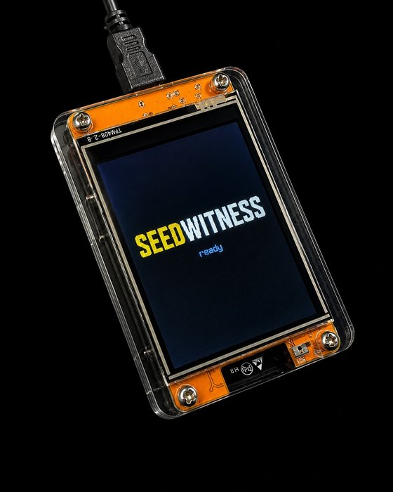

# seedwitness

<p align="center">
  
</p>

SeedWitness calculates seed words from entropy supplied by you, via dice or
coin flips. You can use SeedWitness to check if your device is being honest,
and use other calculators to check SeedWitness.

**It is not a wallet.** It cannot spend and never signs a transaction.

> **Current release:** `0.1.0`. For real wallet material, check out that tag
> and verify the device against the manifest from the same checkout.

**Run it from a power bank, never from a computer or a networked charger.**
The USB port is a full debug port: anything it is plugged into can read the
device's memory and filesystem.

---

## Check the device yourself

Do this first, before you trust it with anything. It takes about a minute and
it does not require trusting this project.

```bash
python -m pip install esptool mpremote littlefs-python
python tools/verify_device.py --port COM9 --manifest manifest.json --firmware ESP32_GENERIC-20260406-v1.28.0.bin
```

It prints `PASS` or it names the file that disagrees.

**Tier 1** reads the bootloader region, partition table and the published bytes
occupying the factory firmware region through the ESP32's ROM bootloader,
which runs before any firmware and is not the thing being audited. It compares
those bytes against the official `ESP32_GENERIC` image from micropython.org.

That image is published by people who have never heard of this project, and
that is the entire point. A signed release verifies that the author's binary
is the author's binary; you still have to trust the author. Here the reference
is a third party's build, so the question "did this project ship you what it
claims" is answered by someone with no stake in the answer.

It is also why the device runs stock firmware rather than a custom build. A
custom build would be more capable and would collapse this check into
"compare against the author's own binary", which proves nothing.

**Tier 2** reads the filesystem partition the same way and, when
`littlefs-python` is installed, parses it on your computer. The device is never
asked what files it holds, so nothing running on it can hide from the listing.
Without that dependency the tool labels and uses a weaker running-firmware
fallback rather than presenting it as equivalent.

A pass means the checked bootloader region, partition table and published
factory-firmware bytes match the supplied official image; every non-runtime
application file parsed from raw LittleFS matches the published manifest; and
no unexpected file is present. NVS, `phy_init` and the named runtime data files
are outside those comparisons. A pass does not make flash immutable or prove
the silicon or ROM interface honest; nothing reachable over USB can.

The device also has a **Verify Build** screen showing a fingerprint you can
compare against `manifest.json` without a computer. That is self-attestation,
and the screen says so: tampered software can report whatever it likes. It
catches a bad deploy, not an attacker.

### Reproducing the manifest

```bash
python -m pip install mpy-cross==1.27.0.post2
./tools/build_mpy.sh
python tools/build_manifest.py --check manifest.json
```

The build refuses uncommitted changes to its device and build-script inputs,
so a published manifest corresponds to committed source. The check reproduces
the committed source and deploy entries and their digests; informational
timestamp and toolchain fields are not part of those digests. CI reproduces
the committed deploy digest on Ubuntu and Windows with pinned
`mpy-cross==1.27.0.post2`. Different `mpy-cross` versions are not reproduction
targets because `.mpy` output is toolchain-dependent.

---

## Check its arithmetic yourself

The firmware check above proves the device is running the published code. This
proves the published code is right, and you can run it without our help.

Download **[Ian Coleman's BIP39 tool](https://iancoleman.io/bip39/)** and open
it offline. To check roll-to-words conversion, show entropy details, choose the
same mnemonic length, select **Hex** or **Base 10**, enter the exact roll string,
and compare all seed words. Do not select its `Dice [1-6]` mode: that mode
interprets a six differently and does not implement this SHA-256 ceremony.

Then enter the words (and exact BIP39 passphrase, if used), choose the same
derivation path, and compare the receive address. The tool shares no code with
this project: it is JavaScript from the bitcoinjs-lib lineage. Agreement checks
both seed generation and address derivation with an unrelated implementation.

SeedSigner is useful for confirming 99-roll interoperability, but it is **not
an independent check of address derivation**. Both devices vendor `embit`, so
an embit bug could produce the same wrong address on each and make agreement
look like confirmation.

Two details matter with Coleman's tool. Its BIP49 and BIP84 tabs use the
SLIP-132 spelling (`ypub`, `zpub`). SeedWitness's optional **Account Key**
screen offers that matching spelling beside the canonical `xpub`; the key
material is identical and only the version bytes differ. Use the form a wallet
requests, but **compare addresses to verify the seed, not account-key
spellings**. The live Coleman tool has no BIP86 tab, so taproot cannot be
checked there.

Independent vector coverage against Coleman's tool and **bip-utils** (Python,
independent BIP39/BIP32) comprises three published test mnemonics, all four
address types, indices 0, 1 and 5, with and without a passphrase, the account
xpub, and the xpub-only path. **100+ comparisons, zero mismatches**, including
the published BIP39 seed vector for passphrase `TREZOR`. That is agreement on
those inputs; it does not prove embit is correct on inputs nobody tested.

## What it does

**Roll.** Roll a die or flip a coin and tap each result. The inputs are
concatenated and hashed with SHA-256; a 12-word seed takes the first 16 bytes
of the digest, a 24-word seed all 32. The device contributes no randomness.
The ceremony is deterministic and can be checked with another implementation
using the same SHA-256-to-BIP39 conversion.

| source | 12 words | 24 words |
|---|---|---|
| coin | 128 flips | 256 flips |
| D6 | 50 rolls | 99 rolls (SeedSigner-compatible) or 100 rolls (full 256-bit input rule) |
| D8 | 43 rolls | 86 rolls |
| D12 | 36 rolls | 72 rolls |

For a 24-word D6 ceremony, the device pauses after roll 99. Finalising there
matches [SeedSigner's documented English-wordlist dice
algorithm](https://github.com/SeedSigner/seedsigner/blob/1fb2956322ea978428a6a96b955baa93e965c877/docs/dice_verification.md)
exactly. Adding roll 100 instead meets SeedWitness's stricter rule of at least
256 bits of raw dice input; because that roll changes the SHA-256 input, it
produces a different seed. Both choices and the second confirmation use
press-and-hold controls.

Before a mnemonic is derived, the device checks for obvious repeated,
sequential, missing-face and non-uniform input. A concern opens **Check Your
Rolls**; the held **Use These Rolls** action remains available because an
unusual-looking sequence is not proof of bad dice. See
[`docs/ENTROPY_CHECKS.md`](docs/ENTROPY_CHECKS.md) for the checks and their
measured false-positive bounds.

**Verify.** Enter a seed you already hold and derive a receive address from
it. If it matches the address your wallet shows, the backup in your hand
reconstructs the wallet you think it does. After the address is shown, the
optional **Account Key** view can display the canonical `xpub` and the matching
`ypub` for BIP49 or `zpub` for BIP84. It writes nothing to flash and keeps the
receive address, not an encoding prefix, as the verification check.

**Enrol.** Enter a seed once, keep the account extended *public* key, forget
the seed. Later checks run from the stored xpub in seconds, with no private
key on the device. Use this mode when the device will check the same wallet
repeatedly.

**Export.** Show the seed as a SeedSigner-compatible CompactSeedQR, gated
behind a warning screen, the longest press-and-hold in the app, and a 20 s
auto-blank: a QR on screen is a machine-readable copy of the whole wallet for
any camera in the room. Export only; the board has no camera.

**Passphrase.** Roll a Diceware passphrase of 6, 8 or 10 words (default 8,
about 103 bits) from the EFF large wordlist, D6 only. Generated rather than
typed because BIP39 requires NFKD normalisation and MicroPython has no
`unicodedata`: a typed non-ASCII passphrase would derive a different wallet
here than in other software. Generated words are ASCII by construction.

**All four address types.** BIP44, BIP49, BIP84 and BIP86. The first
derivation pays the full seed stretch; the other three types reuse the cached
seed at about 9 s each (see
[Measured performance](#measured-performance)). Ask for all four and find the
one your wallet matches, instead of guessing the script type and misreading a
mismatch as a bad backup.

**Saved accounts.** Up to five accounts can be renamed, deleted and shown as
QR. The account key displays as a plain `xpub` and, where SLIP-132 defines a
form, as `ypub` (BIP49) or `zpub` (BIP84): the same key with different version
bytes. BIP44 has no alternate form and SLIP-132 predates taproot; the screen
says so rather than leaving a gap. Enrolled accounts can step through receive
addresses, and each address can be given a neutral "Mark" tick: the device
records the tick and nothing else. Any address can be shown as a QR, ungated,
because an address is public.

**Demonstration mode.** A `[!]` button on the first page of either ceremony
fills in the rolls, behind a confirmation, so you can walk the whole device
without recording 50 real rolls. It is offered only before the first real
roll, so it cannot be injected into a genuine ceremony; every screen it
touches carries a DEMO stamp; the result can never be enrolled.

**Sleep.** After 60 minutes untouched the device shows a 5 minute countdown,
then sleeps. Entering sleep ends the session: the mnemonic, cached seed and
passphrase are dropped, so an unattended device is not holding a seed. Any
touch cancels the countdown or wakes it.

**What it does not do.** Signing, PSBT, multisig, altcoins, camera and
networking are outside scope by design.

---

## Installing

You need the board (an ESP32-2432S028R, sold as a "CYD"), a **data-capable**
USB cable, and a computer with Python 3.10 or later.

The supported pin map, orientation and touch-calibration notes are in
[`docs/HARDWARE.md`](docs/HARDWARE.md).

If you have a coding agent on a machine with the board plugged in, it can do
the whole install from this README: flash the official firmware, build,
deploy, verify. Two things it cannot do for you: confirm the cable carries
data (the most common reason a board never appears as a serial port), and be
the judge of success. Run `verify_device.py` yourself and check it says
`PASS`.

### 1. Install the tools

```bash
python -m pip install esptool mpremote littlefs-python mpy-cross==1.27.0.post2
```

### 2. Get the official MicroPython firmware

Download `ESP32_GENERIC` **v1.28.0** from
<https://micropython.org/download/ESP32_GENERIC/>. Not from anywhere else:
verification compares your board against micropython.org's published image,
which only means something if that is also where your copy came from.

### 3. Find the serial port

Windows shows the board as a `COM` port in Device Manager; macOS and Linux as
`/dev/tty.usbserial-*` or `/dev/ttyUSB0`. If nothing appears, the board's
CH340 USB chip may need a driver. The examples use `COM9`; substitute yours.

### 4. Flash the firmware

```bash
esptool --port COM9 erase-flash
esptool --port COM9 --baud 921600 write-flash -z 0x1000 ESP32_GENERIC-20260406-v1.28.0.bin
```

### 5. Build and copy the application

```bash
git clone https://github.com/bayanimills/seedwitness.git
cd seedwitness
git checkout 0.1.0
./tools/build_mpy.sh
python tools/deploy.py --port COM9
```

Use the `manifest.json` from the same tag. Do not mix source, deploy files, or
a manifest from different revisions. `build_mpy.sh` requires a Bash shell;
the Python deploy command can run from your usual terminal.

The build cross-compiles to `.mpy` bytecode. It is not optional: plain `.py`
files fail with `MemoryError`, because the board lacks the heap to compile
the BIP39 wordlist itself.

`deploy.py` re-reads every file it writes and compares hashes, because
`mpremote cp` returns success on copies it did not make.

### 6. Verify

```bash
python tools/verify_device.py --port COM9 --manifest manifest.json --firmware ESP32_GENERIC-20260406-v1.28.0.bin
```

Do this before you trust the device with anything.

### 7. Unplug it

Power the board from a power bank from here on. The USB port is a debug
interface, not just power.

---

## Development

See [CONTRIBUTING.md](CONTRIBUTING.md) before proposing a change. In
particular, never put real wallet material in an issue, pull request, test,
log, or screenshot.

```bash
./tools/build_mpy.sh                    # cross-compile to _build_mpy/
python tools/build_manifest.py -o manifest.json
python tools/deploy.py --port COM9      # copy, then verify by hash
python tools/deploy.py --port COM9 --dry-run   # report drift, change nothing
```

Set `SEEDWITNESS_ALLOW_DIRTY=1` to build from a dirty tree during
development, never for a build whose manifest you intend to publish.

### Testing

```bash
python -m venv .venv
python -m pip install -r requirements.txt
python -m pytest tests/ -q
```

Virtual-environment activation is `.venv\Scripts\Activate.ps1` in Windows
PowerShell or `source .venv/bin/activate` on macOS and Linux. The deploy build
script requires a Bash shell.

The desktop simulator drives the real UI code through a PIL-backed canvas:

```bash
python sim/capture_screens.py       # one PNG per screen, into screenshots/
```

Physical-panel comparison is required because simulator agreement does not
establish panel rendering or touch behaviour:

```bash
python -m mpremote connect COM9 run device_tests/golden_frame.py > cap.txt
python tools/golden_frame.py --capture cap.txt
```

---

## Measured performance

Measured on the board (ESP32-D0WD-V3, MicroPython v1.28.0, 240 MHz),
2026-08-05.

| operation | time |
|---|---|
| Address from a mnemonic, first | 575 s (9.6 min) |
| Address from a mnemonic, seed cached | ~9 s |
| Address from an enrolled xpub | ~3.1 s |

The 575 s (9.6 min) is PBKDF2-HMAC-SHA512 in pure Python and is a floor on stock
firmware, not a tuning problem: this MicroPython port exposes no native
SHA-512. It is why enrolment exists. Pay it once, then never again.

Stepping to the next address on screen takes a little longer than 3.1 s, since
each step redraws the whole display.

---

## What makes it safe

**It has no random number generator.** Your dice decide the seed; the device
only works out which words they come to. The device has no internal entropy
source whose failure can weaken generated seeds.

**Which means you can check its work.** The conversion is deterministic.
Enter the same roll string into an independent implementation of this
SHA-256-to-BIP39 ceremony and confirm every word, then compare an address.
The exact offline Coleman procedure is described in
[Check its arithmetic yourself](#check-its-arithmetic-yourself).

**It cannot spend.** No signing code, no PSBT, no transaction construction. A
compromised seedwitness cannot move coins, only lie about an address, and
comparing against your wallet is what catches that.

**Enrolment removes the secret entirely.** After enrolling an account, repeat
checks run from an extended *public* key. A stolen or tampered device that
holds no private key downgrades from "funds gone" to "someone learned which
addresses are yours".

**The seed does not outlive the session.** Returning home, backing out and
falling asleep all drop the mnemonic, passphrase and cached seed together.
After 60 idle minutes it does this without being asked, because unattended is
the state a device is usually found in.

**And you can verify the firmware against a stranger's binary**, per
[Check the device yourself](#check-the-device-yourself).

## What it cannot do

**The radios exist and cannot be disabled.** The board has wifi and bluetooth;
calling the teardown boot-loops it. This firmware never opens a connection,
but that is a property of the code you can read, not a guarantee from the
hardware. It is offline because of where you keep it.

**USB is a full debug port.** Anything you plug it into can read memory and
the filesystem. Run it from a power bank.

**Physical access wins.** No secure boot, no flash encryption, no secure
element. Anyone holding the board can reflash it. `verify_device.py` detects
that afterwards; nothing prevents it. Keep it where you would keep a paper
backup.

**It cannot judge your dice.** Obvious patterns trigger an advisory warning,
but the device cannot prove that a die was fair, private or actually rolled.
A loaded die or copied sequence can look ordinary, and choosing **Use These
Rolls** for predictable input still produces a predictable seed. Nothing on
the device sees the physical world.

**An enrolled account is a privacy exposure until you delete it.** An xpub
contains no key, but anyone who reads the device can derive every address in
that account. Deleting it removes the record and you can re-enrol at any time.
Disclosure cannot be undone: an xpub already read cannot be recalled, and
cannot be rotated without moving coins.

[`SECURITY.md`](SECURITY.md) states the current threat model, known
limitations, supported versions, and vulnerability-reporting process.

---

## Layout

```
device/          what runs on the board
  seedwitness/     ceremony, derivation, attestation, UI
    ui/flow_*.py     screens loaded on navigation, released on leaving
  embit/           vendored: BIP39, BIP32, secp256k1
  mp_shims/        stdlib gaps on stock MicroPython
sim/             PIL-backed canvas: screenshots and UI tests
tools/           build, manifest, deploy, verification
tests/           desktop test suite
device_tests/    run under real MicroPython
docs/            hardware profile, design system, entropy checks
```

Current supporting documentation:

- [`docs/HARDWARE.md`](docs/HARDWARE.md): CYD pin map, display and touch
  profile, clock behaviour and hardware constraints.
- [`docs/DESIGN.md`](docs/DESIGN.md): typography, geometry, colour roles and
  rendering constraints.
- [`docs/ENTROPY_CHECKS.md`](docs/ENTROPY_CHECKS.md): advisory roll-input
  checks and their measured false-positive bounds.

`embit` is vendored pruned to the modules this project imports; every
retained file is unmodified and diffable against upstream (see
`device/embit/NOTICE.md`). It is also the library SeedSigner depends on, so
agreement between the two devices is not an independent check: a bug in embit
would agree with itself. See [Check its arithmetic
yourself](#check-its-arithmetic-yourself).

## Help and contributing

For installation, verification, or device-use help, read
[SUPPORT.md](SUPPORT.md). Reproducible bugs and focused proposals are welcome
through the GitHub issue forms. Read [CONTRIBUTING.md](CONTRIBUTING.md) before
opening a pull request.

Never post real wallet material. Report vulnerabilities using the private
instructions in [SECURITY.md](SECURITY.md), not a public issue.

## Licence

SeedWitness is available under the [MIT License](LICENSE). Incorporated
material keeps its own licence; sources, modifications, attribution, and
licence texts are recorded in
[THIRD_PARTY_NOTICES.md](THIRD_PARTY_NOTICES.md).
